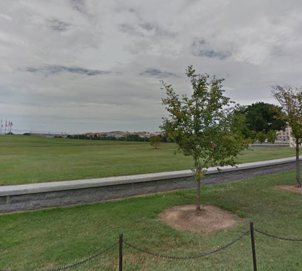
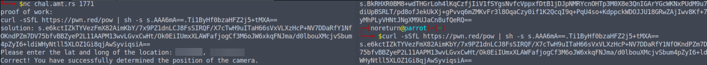

# cherry_blossoms

### Desccription :
average southern californian reacts to DC weather. amazing scenery though at the time.

Find the coords of this image!

Grader Command: nc chal.amt.rs 1771

### Downloads

[challenge.png](challenge.png)
[main.py](main.py)

## Solution

read description, we have to find coords of given image, for that we can use gmap if we have location.

again read description closer `DC weather` DC ?, in image you can see some flags in circling, when you search in google you will find that it's belongs to `The Washington Monument`.

go to the map and search for that, and walk around wat near `Washington Monument` for find similer image as given photo. and you will find :

you will also get coords for that in url :

go to the terminal and follow given Command: `nc chal.amt.rs 1771`

you will get your flag 😉.

#### flag :   amateursCTF{l00k1ng_l0v3ly_1n_4k}