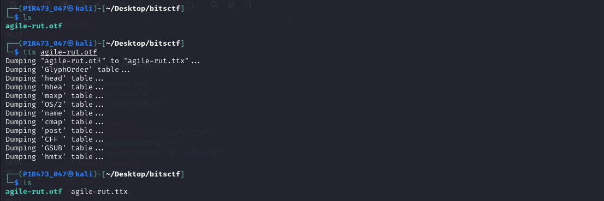

# Agile-rut


### Desccription :

check out this cool font i made!
`http://agile-rut.amt.rs`
hint: if you get something that looks like the flag try pasting it into the box.

## Downloads

[agilerut.otf](agilerut.otf)


## Solution

there is a website link, open it and there is nothing special except a otf file. i will provide it in downloads.


for solve this challenge simply covert otf to ttx using `ttx` command in linux 
  
    command: ttx agilerut.otf

by doing this you get a file [agilerut.ttx](agile_rut.ttx) in same directory you are.



open [file](agile_rut.ttx) and you will find string as follow :

```text

        <LigatureSet glyph="a">
            <Ligature components="m,a,t,e,u,r,s,c,t,f,braceleft,zero,k,underscore,b,u,t,underscore,one,underscore,d,o,n,t,underscore,l,i,k,e,underscore,t,h,e,underscore,j,b,m,o,n,zero,underscore,equal,equal,equal,braceright" glyph="lig.j.u.s.t.a.n.a.m.e.o.k.xxxxxxxxx.xxxx.x.xxxxxxxxxx.x.x.x.xxxxxxxxxx.xxx.xxxxxxxxxx.x.x.x.x.xxxxxxxxxx.x.x.x.x.xxxxxxxxxx.x.x.x.xxxxxxxxxx.x.x.x.x.x.xxxx.xxxxxxxxxx.xxxxx.xxxxx.xxxxx.xxxxxxxxxx"/>
          </LigatureSet>

```

`"m,a,t,e,u,r,s,c,t,f,braceleft,zero,k,underscore,b,u,t,underscore,one,underscore,d,o,n,t,underscore,l,i,k,e,underscore,t,h,e,underscore,j,b,m,o,n,zero,underscore,equal,equal,equal,braceright"`

convert it to :

`amateursctf{0k_but_1_dont_like_the_jbmon0_===}`

and thats your flag

#### flag :   amateursctf{0k_but_1_dont_like_the_jbmon0_===}