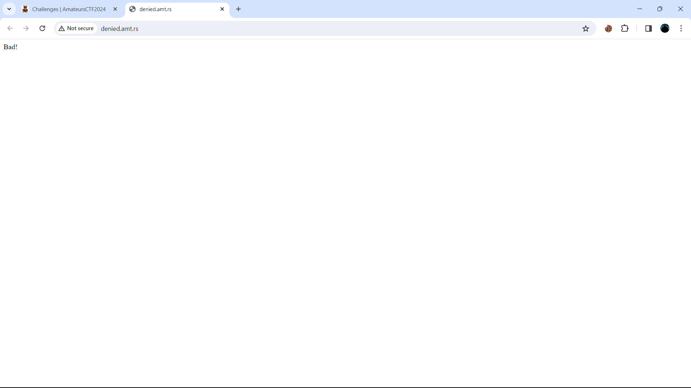

# Denied


### Desccription :
what options do i have?
`http://denied.amt.rs`


## Solution

This challenge was very simple, we have a file given name index.js


<details>
<summary markdown="span">Click to see Index.js : </summary>

```javascript
 
 const express = require('express')
const app = express()
const port = 3000

app.get('/', (req, res) => {
  if (req.method == "GET") return res.send("Bad!");
  res.cookie('flag', process.env.FLAG ?? "flag{fake_flag}")
  res.send('Winner!')
})

app.listen(port, () => {
  console.log(`Example app listening on port ${port}`)
})


```

</details>


when we visit website we get Bad! in response :




in given javascript file we can see that `  if (req.method == "GET") return res.send("Bad!");` 
means we can not use GET method. 

let's try using POST method in burpsuit.


when we use post we get response like ` can not post` 

now what we can do is try to use HEAD method:


and Boom, in head method we get our flag. 

#### flag :   famateursCTF{s0_m@ny_0ptions...}