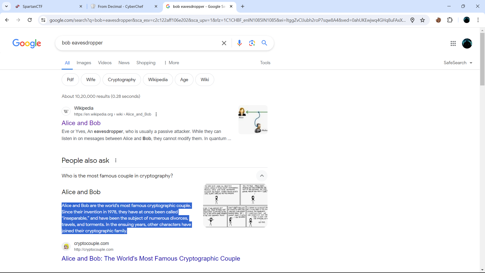

# Evesdropper

### Description :
My friend Eve hired me to find out who Bob has been messaging. Unfortunately, all his messages are encrypted with a cipher I don't recongize! I mananged to intecept a message to Bob using a man-in-the-middle attack, but this seems like a really tough hack. I wonder if there's an easier way to find out who he's talking to...

Format the flag like this: spartanCTF{name of person in all lowercase} ie; spartanCTF{mallory}, spartanCTF{trudy} (these are not the actual flag, but they are hints)

BEGIN CIPHERTEXT 78 105 99 101 32 106 111 98 32 114 101 99 111 110 103 105 122 105 110 103 32 65 83 67 73 73 44 32 98 117 116 32 116 104 105 115 32 119 97 115 32 106 117 115 116 32 97 32 114 101 100 32 104 101 114 114 105 110 103 33 32 82 101 109 101 109 98 101 114 44 32 104 97 99 107 105 110 103 32 105 115 32 97 98 111 117 116 32 102 105 110 100 105 110 103 32 116 104 101 32 101 97 115 105 101 115 116 32 119 97 121 32 116 111 32 103 101 116 32 116 104 101 32 100 97 116 97 32 121 111 117 32 110 101 101 100 46 32 73 110 32 97 32 114 101 97 108 32 119 111 114 108 100 32 115 99 101 110 97 114 105 111 44 32 121 111 117 32 109 105 103 104 116 32 116 114 121 32 103 111 111 103 108 105 110 103 32 66 111 98 32 116 111 32 115 101 101 32 119 104 111 32 104 101 39 115 32 107 110 111 119 110 32 116 111 32 98 101 32 114 101 103 117 108 97 114 108 121 32 105 110 32 99 111 110 116 97 99 116 32 119 105 116 104 32 40 115 111 99 105 97 108 32 109 101 100 105 97 47 98 108 111 103 32 112 111 115 116 115 44 32 112 105 99 116 117 114 101 115 44 32 98 117 115 105 110 101 115 115 32 112 114 111 102 105 108 101 115 44 32 101 116 99 41 46 32 77 97 121 98 101 32 121 111 117 32 99 111 117 108 100 32 101 118 101 110 32 116 114 121 32 103 111 111 103 108 105 110 103 32 115 101 118 101 114 97 108 32 111 102 32 116 104 101 32 110 97 109 101 115 32 112 114 111 118 105 100 101 100 32 116 111 103 101 116 104 101 114 32 97 110 100 32 115 101 101 32 119 104 97 116 32 121 111 117 32 103 101 116 46 46 46 END CIHPERTEXT

## Solution

given cypher is decimal, decode it using any decryption tool from decimal and you will get following string :

`Nice job recongizing ASCII, but this was just a red herring! Remember, hacking is about finding the easiest way to get the data you need. In a real world scenario, you might try googling Bob to see who he's known to be regularly in contact with (social media/blog posts, pictures, business profiles, etc). Maybe you could even try googling several of the names provided together and see what you get...`

as this string say just google the name bob with other name is given, hmmmmm 😕 what other name ?

you can use challenge name with bob like `Evesdropper bob` , by searching this on google you will fing that:

`Alice and Bob are the world's most famous cryptographic couple. Since their invention in 1978, they have at once been called “inseparable,” and have been the subject of numerous divorces, travels, and torments. In the ensuing years, other characters have joined their cryptographic family.`

as discription say ``Format the flag like this: spartanCTF{name of person in all lowercase} ie; spartanCTF{mallory}, spartanCTF{trudy} (these are not the actual flag, but they are hints)``

us name alice for flag and it will be :spartanCTF{alice}
#### flag :   spartanCTF{alice}