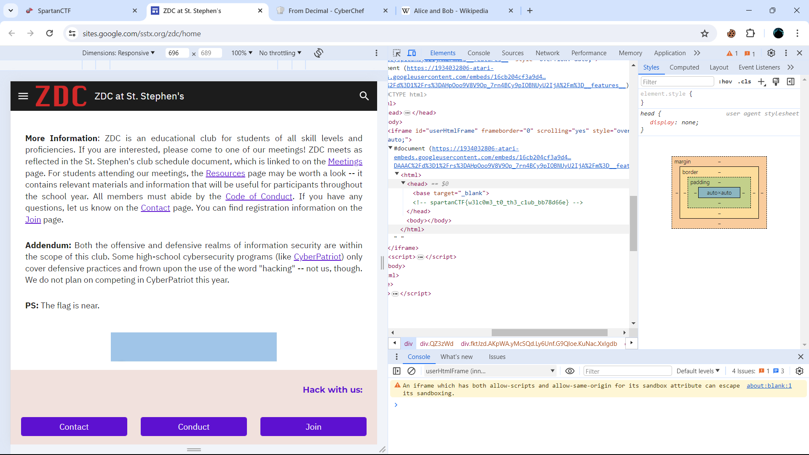

# Touch Base

### Description :
Welcome to the first-ever SpartanCTF! This contest is sponsored by the Zero-Day Club at St. Stephen's. If you want to learn more about ZDC, take a look at our [website!](https://sites.google.com/sstx.org/zdc/home)

## Solution

This challenge was very simple, when we look at website given there is text like `PS: The flag is near.` just inspect element and you will find a html tab insite the code look at head of that tab and you will get your flag 

`<head><base target="_blank"><!-- spartanCTF{w3lc0m3_t0_th3_c1ub_bb78d66e} --></head>`

#### flag :   spartanCTF{w3lc0m3_t0_th3_c1ub_bb78d66e}