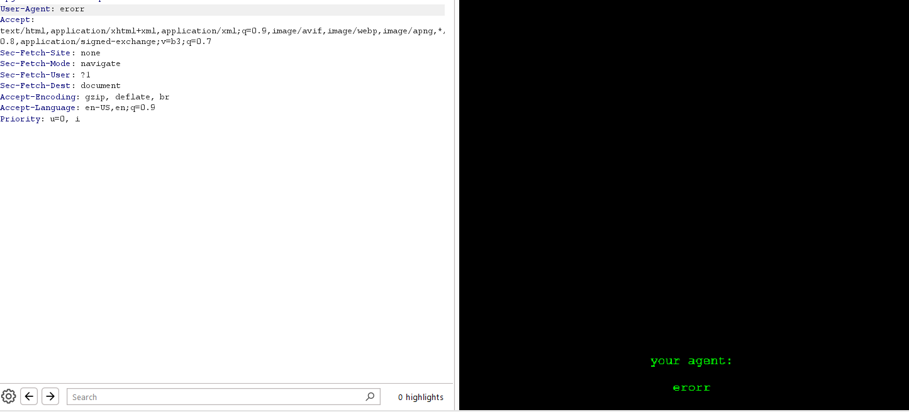

# Silent_Watcher


### Description:

Beware, pirates. Every step you take is being carefully logged. Your actions are under constant surveillance, and your next move might reveal more than you intend. Start your investigation from [here](https://simple.uctf.ir/), but tread carefully.

https://simple.uctf.ir/


## Solution

this challenge was so easy, visit the given web link, its simple page and prints I log everything for admins so be careful.


and at footer it print your agent. hmmmm, did you get it. lets try to change user agent 'User-Agent: Mozilla/5.0 (Windows NT 10.0; Win64; x64) AppleWebKit/537.36 (KHTML, like Gecko) Chrome/123.0.6312.58 Safari/537.36' to 'erorr' using burpsuit.
  




now footer shows the message that we send in user agent.


Now lets try to add script for show alert :

```code

User-Agent:<script>alert(1)</script>

```


boom:


you have your flag.


#### flag :  uctf{Ir4n_Masal_County}