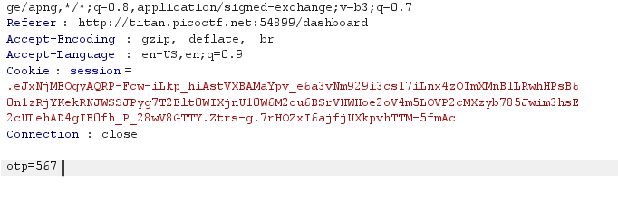
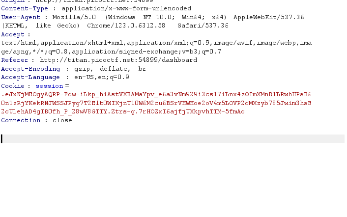
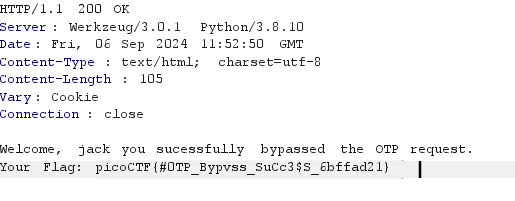

# IntroToBurp

### Description:

Try [here](http://titan.picoctf.net:52988/) to find the flag

## Solution

Browse the given link, as name says this challange is just about intro to burpsuit.

for solve this challange open burpsuit, open that link fill given filds and submit. after submiting data you have to enter OTP for 2fa authentication, enter any number and submit.

now open HTTP history in burpsuit there you will have some http requests one of them is for OTP (POST /dashboard ) open that with repeater and simply remove opt fild and send request.

before:

after:

booomm,  you have your flag.

#### flag :   picoCTF{#0TP_Bypvss_SuCc3$S_6bffad2}