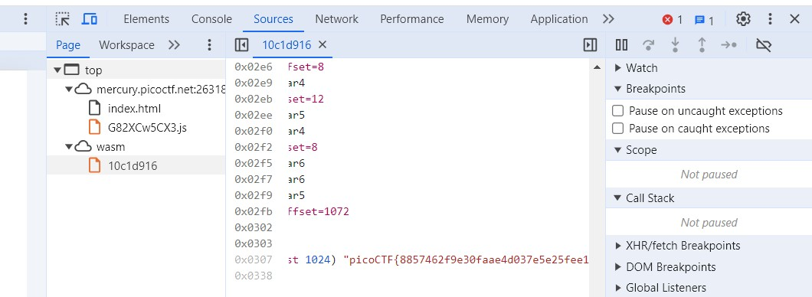

# Some_Assembly_Required_1


### Desccription :

http://mercury.picoctf.net:26318/index.html

## Solution

what we have in description is just link of website 😕.

in the sourcecode we have link of javascript file and that have some script.


<details>
<summary markdown="span">Click to see script : </summary>

       const _0x402c=['value','2wfTpTR','instantiate','275341bEPcme','innerHTML','1195047NznhZg','1qfevql','input','1699808QuoWhA','Correct!','check_flag','Incorrect!','./JIFxzHyW8W','23SMpAuA','802698XOMSrr','charCodeAt','474547vVoGDO','getElementById','instance','copy_char','43591XxcWUl','504454llVtzW','arrayBuffer','2NIQmVj','result'];const _0x4e0e=function(_0x553839,_0x53c021){_0x553839=_0x553839-0x1d6;let _0x402c6f=_0x402c[_0x553839];return _0x402c6f;};(function(_0x76dd13,_0x3dfcae){const _0x371ac6=_0x4e0e;while(!![]){try{const _0x478583=-parseInt(_0x371ac6(0x1eb))+parseInt(_0x371ac6(0x1ed))+-parseInt(_0x371ac6(0x1db))*-parseInt(_0x371ac6(0x1d9))+-parseInt(_0x371ac6(0x1e2))*-parseInt(_0x371ac6(0x1e3))+-parseInt(_0x371ac6(0x1de))*parseInt(_0x371ac6(0x1e0))+parseInt(_0x371ac6(0x1d8))*parseInt(_0x371ac6(0x1ea))+-parseInt(_0x371ac6(0x1e5));if(_0x478583===_0x3dfcae)break;else _0x76dd13['push'](_0x76dd13['shift']());}catch(_0x41d31a){_0x76dd13['push'](_0x76dd13['shift']());}}}(_0x402c,0x994c3));let exports;(async()=>{const _0x48c3be=_0x4e0e;let _0x5f0229=await fetch(_0x48c3be(0x1e9)),_0x1d99e9=await WebAssembly[_0x48c3be(0x1df)](await _0x5f0229[_0x48c3be(0x1da)]()),_0x1f8628=_0x1d99e9[_0x48c3be(0x1d6)];exports=_0x1f8628['exports'];})();function onButtonPress(){const _0xa80748=_0x4e0e;let _0x3761f8=document['getElementById'](_0xa80748(0x1e4))[_0xa80748(0x1dd)];for(let _0x16c626=0x0;_0x16c626<_0x3761f8['length'];_0x16c626++){exports[_0xa80748(0x1d7)](_0x3761f8[_0xa80748(0x1ec)](_0x16c626),_0x16c626);}exports['copy_char'](0x0,_0x3761f8['length']),exports[_0xa80748(0x1e7)]()==0x1?document[_0xa80748(0x1ee)](_0xa80748(0x1dc))[_0xa80748(0x1e1)]=_0xa80748(0x1e6):document[_0xa80748(0x1ee)](_0xa80748(0x1dc))[_0xa80748(0x1e1)]=_0xa80748(0x1e8);} 

                               
</details>

what we can do is past this script in vscode and formate it for clear code, and understand the code, how the functions work and how to run it and get the flag.

OR

or, we can find the flag in simple way, just look at code we have path for a file name './JIFxzHyW8W' , just enter that path and you will get a file with flag.

<details>
<summary markdown="span">Click to see script : </summary>

```text

 asm   `  `` `  p 1A°Š
 A°
 A€
 A°

 A€
 A°Š
 A 
 A
 ¡memory __wasm_call_ctors  strcmp 
check_flag input	copy_char __dso_handle
__data_end
__global_base
__heap_base
__memory_base__table_base 
ú 
ç*#€€€€ !A !  k!   6  6 (!  6 (!  6@@ (! A!   j!	  	6  -  !
  
: 
 (!
A! 
 j!
  
6 
-  !  : 
 - 
!Aÿ!  q!@ 
  - 
!Aÿ!  q! - 
!Aÿ!  q!  k!  6
 - 
!Aÿ!  q! - 
!Aÿ!  q! ! !    F!!A!" ! "q!# #
 
 - 
!$Aÿ!% $ %q!& - 
!'Aÿ!( ' (q!) & )k!*  *6
 (!+ +
L
A ! A°ˆ€€ !A€ˆ€€ !  €€€ ! !  !  G!A!    s!A!	  	q!
 

?#€€€€ !A!  k!   6  6 (! (!  : °ˆ€€ 

2 A€
+picoCTF{8857462f9e30faae4d037e5e25fee1ce}  

```

</details>

OR

in other way, just go to sorces of wesite ( rigth click >> inspect >> sorces ) in that you will find some pages, go to wasm >> 10c1d916 , at the and you will get the flag. 




#### flag :   picoCTF{8857462f9e30faae4d037e5e25fee1ce}